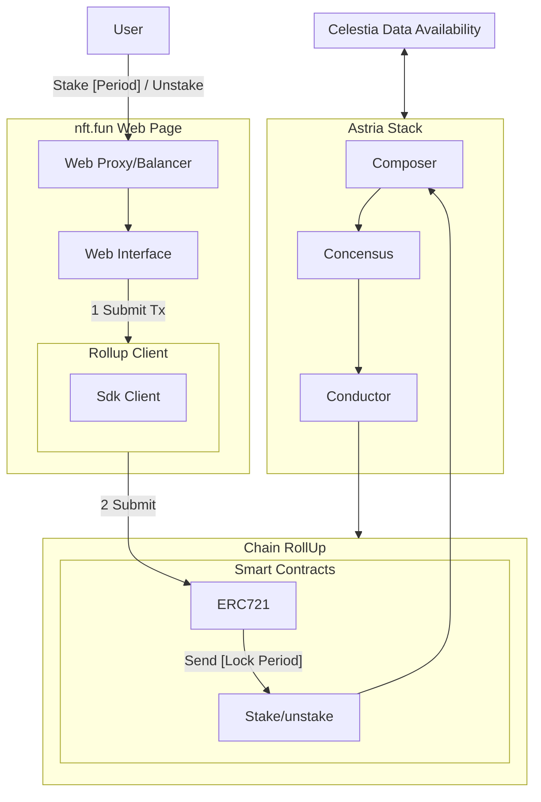
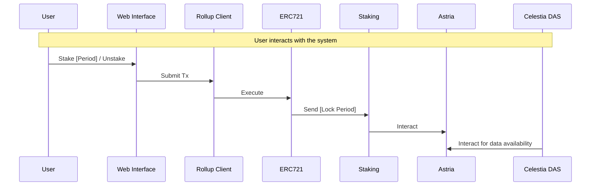

# Design Specifications

## Architecture

### Flowchart Diagram

### Components

- User: The end-user interacting with the system.
- Frontend: The web page (**nft.fun**) that provides a user interface for interacting with the system.
  - RKC (Rollup Client): A sub-component of the Frontend, responsible for interacting with the Rollup smart contracts.
  - RKC_A (Sdk Client): A specific client within the RKC, likely used for interacting with the SDK (Software Development Kit).
  - Proxy: A web proxy or load balancer that routes requests between the User and the Web Interface.
  - UI (Web Interface): The user-facing interface that interacts with the Proxy and the Rollup Client.
- RK (Chain RollUp): The core Rollup smart contract system.
  - RK_SC (Smart Contracts): A sub-component of RK, containing various smart contracts.
  - RK_SC_721 (ERC721): A specific smart contract implementing the ERC721 standard for non-fungible tokens (NFTs).
  - RK_SC_721_STAKE (Stake/unstake): A smart contract responsible for staking and unstaking NFTs.
- Celestia (Celestia Data Availability): A separate component responsible for data availability, likely providing a decentralized storage solution.
- Astria (Astria Stack): A component that interacts with Celestia and is responsible for the Astria stack, which includes:
  - Composer: A component that interacts with the Stake/unstake smart contract.
  - Concensus: A component that interacts with the Composer and is responsible for achieving consensus.
  - Conductor: A component that interacts with the Concensus and is responsible for conducting or managing the flow of data.

### Interactions

1. The User interacts with the Proxy to stake or unstake NFTs for a specified period.
2. The UI submits a transaction to the Rollup Client.
3. The Rollup Client submits the transaction to the ERC721 smart contract.
4. The ERC721 smart contract sends a transaction to the Stake / Unstake smart contract, specifying a lock period.
5. The Stake/unstake smart contract interacts with the Astria Composer component.
6. Celestia and Astria interact with each other for data availability and storage.
7. The Conductor component interacts with the Chain RollUp to manage or conduct the flow of data.

## Sequence Diagram

