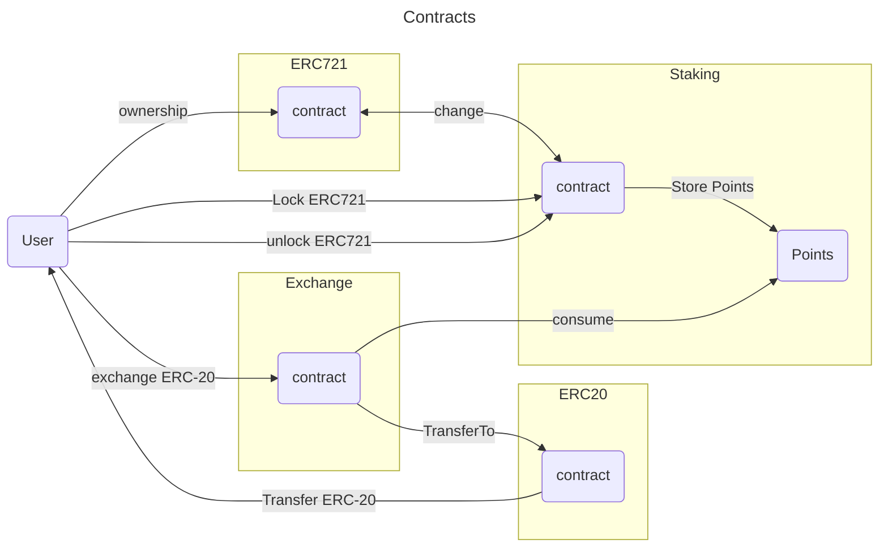
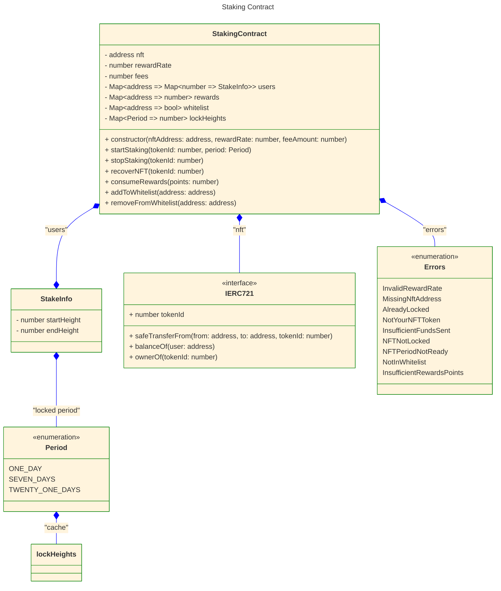

# Design Specifications

## NFT Locking and Reward System

- The `NFT Locking` contract is the responsible for:
  - Ownership the `ERC721` on `lockNFT` until users `unlockNFT` and `recoverNFT` them.
  - Keep track of `rewards` according to the `lockNFT` block height and `unlockNFT` block height.
  - Define the `rewardRate` earn by emitted block.
- The `Exchange` contract is the responsible for:
  - Allow users to exchange `rewards` points for `ERC20` tokens contract according to a ratio.

### Class Diagram

