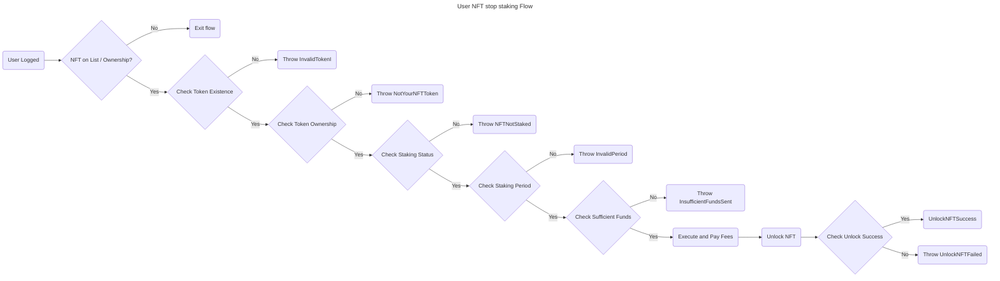

# 2. User NFT Unlock Flow



## Contract

### Errors

The contract throws the following errors:

```solidity
// Custom error types
error InvalidFees(); // thrown when the fees are invalid (less than 0)
error InvalidRewardRate(); // thrown when the reward rate is invalid (less than 0)
error MissingNftAddress(); // thrown when the NFT contract address is not provided
error NFTAddressCannotBeZero(); // thrown when the NFT contract address is the zero address
error InvalidTokenId(); // thrown when the token ID does not exist
error NotYourNFTToken(); // thrown when the token does not belong to the user attempting an action
error InsufficientFundsSent(); // thrown when insufficient funds are sent for fees
error ClaimNotReady(); // thrown when (block.number - (stop + period)) blocks is less than 0
error Unauthorized(); // thrown when has no enough access permissions
error InvalidPeriod(); // thrown when the staking period is not valid enumerate option
error AlreadyStaked(); // thrown when attempting to start staking for a token already staked
error NFTNotStaked(); // thrown when attempting to stop staking for a token not staked by the user
```

### Events

```solidity
// Define events
event LockNFTSuccess(bool success);
event UnlockNFTSuccess(bool success);
event RecoverNFTSuccess(bool success);
event ConsumeRewardsSuccess(bool success);
```

### Structs

```solidity
// Enum for periods
enum Period {
    ONE_DAY,
    SEVEN_DAYS,
    TWENTY_ONE_DAYS
}

// Struct for TokenData
struct TokenData {
    Period period; // Represents the period measured by height units that the NFT gets lock after unlocked where no Rewards are generated during this Period.
    uint256 start; // Starting height use on rewards calculation. Start when the owner stake and transfer ownership.
    uint256 end; // Ending height use on rewards calculation. Once unstake it, no more rewards will be counted.
}

// Struct for UserData
struct UserData {
    uint256 rewards; // Acumulated reward points, only updated when claim successful.
    mapping(uint256 => TokenData) tokens; // User token mapping data
}
```

### Variables

```solidity
// State Variables
address public nft; // Represents the ERC721 address
uint256 public rewardRate; // Represents how many rewards are produced by each height increase while staked
uint256 public fees; // Fees for startStaking(), stopStaking() and recover()
mapping(address => UserData) public users; // users staking and nft data
mapping(address => bool) public whitelist; // list of smart contracts that can interact with user points
```

### Functions

```solidity
/**
 * @dev Constructor function for the contract
 * @param _nftAddress Address of the NFT contract
 * @param _rewardRate Reward rate for staking
 * @param _feeAmount Fee amount for locking NFTs
 */
constructor(address _nftAddress, uint256 _rewardRate, uint256 _feeAmount) public {
  // - Store the owner.
  // - Check `rewardRate` =< 0
  //   - Throw `InvalidRewardRate`.
  // - Set `rewardRate`.
  // - Check `erc721` address == "".
  //   - Throw `MissingNftAddress`
  // - Check `erc721` address == 0.
  //   - Throw `NFTAddressCannotBeZero`
  // - Set `erc721` address.
  // - Check `rewardRate` < 0
  //   - Throw `InvalidFees`.
  // - Set `fees`.
}
```

```solidity
// --- Execute: unlockNFT ---
/**
 * @dev Unlock NFT
 * @param tokenId Token ID to unlock
 */
function unlockNFT(uint256 tokenId) public payable {
    // Check if tokenId exists
    // Check tokenId ownership
    // Check if tokenId is staked
    // Check if funds sent are sufficient
    // Update UserData.end with actual height value
    // Return true
}
```

## User Scenarios

```gherkin
Feature: Unlock NFT
  As a user
  I want to be able to unlock my NFT
  So that I can use it or transfer it to another user

  Scenario: Unlock NFT successfully
    Given I am a user with an NFT that is staked
    And I have sufficient funds to pay the fees
    When I call the unlockNFT function with my NFT's tokenId
    Then the NFT is unlocked
    And the transaction is successful

  Scenario: Unlock NFT that does not exist
    Given I am a user with a non-existent NFT
    When I call the unlockNFT function with the non-existent NFT's tokenId
    Then an error is thrown with the message "InvalidTokenId"

  Scenario: Unlock NFT that I do not own
    Given I am a user with an NFT that is owned by another user
    When I call the unlockNFT function with the NFT's tokenId
    Then an error is thrown with the message "NotYourNFTToken"

  Scenario: Unlock NFT that is not staked
    Given I am a user with an NFT that is not staked
    When I call the unlockNFT function with the NFT's tokenId
    Then an error is thrown with the message "NFTNotStaked"

  Scenario: Unlock NFT without sufficient funds
    Given I am a user with an NFT that is staked
    And I have insufficient funds to pay the fees
    When I call the unlockNFT function with my NFT's tokenId
    Then an error is thrown with the message "InsufficientFundsSent"

  Scenario: Unlock NFT with invalid tokenId
    Given I am a user with a non-existent NFT
    When I call the unlockNFT function with the non-existent NFT's tokenId
    Then an error is thrown with the message "InvalidTokenId"

  Scenario: Attempt to unlock an NFT that is not owned by the user
    Given I am a user with an NFT that is owned by another user
    When I call the unlockNFT function with the NFT's tokenId
    Then an error is thrown with the message "NotYourNFTToken"

  Scenario: Attempt to unlock an NFT that is not staked
    Given I am a user with an NFT that is not staked
    When I call the unlockNFT function with the NFT's tokenId
    Then an error is thrown with the message "NFTNotStaked"

  Scenario: Unlock NFT with invalid fees
    Given I am a user with an NFT that is staked
    And the fees are invalid
    When I call the unlockNFT function with my NFT's tokenId
    Then an error is thrown with the message "InvalidFees"

  Scenario: Unlock NFT with invalid staking period
    Given I am a user with an NFT that is staked
    And the staking period is not valid
    When I call the unlockNFT function with my NFT's tokenId
    Then an error is thrown with the message "InvalidPeriod"

  Scenario: Unlock NFT with valid tokenId and sufficient funds
    Given I am a user with an NFT that is staked
    And I have sufficient funds to pay the fees
    When I call the unlockNFT function with my NFT's tokenId
    Then the NFT is unlocked
    And the transaction is successful
```

### Acceptance Criteria

1. The `unlockNFT` function is able to unlock an NFT that is staked.
2. The `unlockNFT` function throws an error when attempting to unlock an NFT that does not exist.
3. The `unlockNFT` function throws an error when attempting to unlock an NFT that is owned by another user.
4. The `unlockNFT` function throws an error when attempting to unlock an NFT that is not staked.
5. The `unlockNFT` function checks for sufficient funds to pay the fees before unlocking the NFT.
6. The `unlockNFT` function updates the NFT's status to "unlocked" after successful unlocking.
7. The `unlockNFT` function returns a success message after successful unlocking.
8. The `unlockNFT` function throws an error when the fees are invalid.
9. The `unlockNFT` function throws an error when a user attempts to unlock an NFT without sufficient access permissions.
10. The `unlockNFT` function throws an error when the staking period is not valid.

### Test Data Requirements

1. A user with an existing NFT that is staked.
2. A user with a non-existent NFT.
3. A user with an NFT that is owned by another user.
4. A user with an NFT that is not staked.
5. A user with sufficient funds to pay the fees.
6. A user with insufficient funds to pay the fees.
7. An NFT with a valid `tokenId`.
8. An NFT with an invalid `tokenId`.
9. A valid staking period.
10. An invalid staking period.

### Definition of Done (DoD)

1. The `unlockNFT` function has been implemented and tested with the acceptance criteria.
2. The `unlockNFT` function has been reviewed and verified by a peer.
3. The `unlockNFT` function has been deployed to a test environment and tested with the test data requirements.
4. The `unlockNFT` function has been deployed to a production environment.
5. The `unlockNFT` function has been monitored for any errors or issues and updated as necessary.
6. The documentation for the `unlockNFT` function has been updated to reflect any changes or updates.
7. The `unlockNFT` function has been tested for security vulnerabilities and updated as necessary.
8. The `unlockNFT` function has been tested for edge cases and updated as necessary.
9. The `unlockNFT` function has been tested for contract events and updated as necessary.
10. The `unlockNFT` function has been tested for staking period and updated as necessary.

## Description

### Unlock NFT Functionality Explanation

### Step-by-Step Breakdown of `unlockNFT` Function

```markdown
#### **Step 1: Function Call & Input Validation**
* The user calls the `unlockNFT` function, passing the `tokenId` of the NFT to be unlocked.
* **Validation Check**: The function verifies if the `tokenId` exists in the contract's NFT registry.
 + **Success**: Proceeds to the next step.
 + **Failure**: Throws an **`InvalidTokenId`** error.

#### **Step 2: Ownership Verification**
* The function checks if the caller (user) is the rightful owner of the NFT associated with the provided `tokenId`.
 + **Success**: Proceeds to the next step.
 + **Failure**: Throws a **`NotYourNFTToken`** error.

#### **Step 3: Staking Status Check**
* The contract verifies if the NFT (identified by `tokenId`) is currently in a staked state.
 + **Success**: Proceeds to the next step.
 + **Failure**: Throws an **`NFTNotStaked`** error.

#### **Step 4: Fee Sufficiency Check**
* The function checks if the user has sent sufficient funds to cover the fees associated with unlocking the NFT.
 + **Success**: Proceeds to the next step.
 + **Failure**: Throws an **`InsufficientFundsSent`** error.

#### **Step 5: Update NFT Status & Calculate Rewards (If Applicable)**
* Updates the NFT's status to "unlocked" in the contract's registry.
* **Note**: The provided code snippet does not explicitly mention reward calculation upon unlocking. However, typically, this step might also involve calculating and possibly distributing rewards based on the staking duration and reward rate, if such a mechanism is implemented in the full contract.

#### **Step 6: Emit Success Event & Return**
* Emits an **`UnlockNFTSuccess`** event to notify listeners of the successful unlocking.
* Returns a success indicator to the caller, confirming the NFT has been unlocked.
```

### Additional Considerations & Potential Next Steps

* **Error Handling for Staking Period**: The provided scenarios and code do not explicitly cover the case where the staking period is not valid at the time of unlocking. Ensure this scenario is handled appropriately in the full implementation.
* **Security Audits & Testing**: Perform thorough security audits and testing to ensure the `unlockNFT` function, along with the entire contract, is secure and functions as expected under various conditions.
* **Documentation & User Guidance**: Maintain clear, up-to-date documentation for developers and end-users, outlining the process, requirements, and any specific considerations for unlocking NFTs within the platform.
