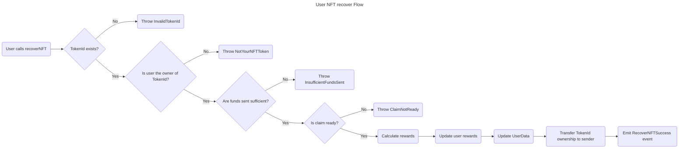

# 3. User NFT Recover Flow



## Contract

### Errors

The contract throws the following errors:

```solidity
// Custom error types
error InvalidFees(); // thrown when the fees are invalid (less than 0)
error InvalidRewardRate(); // thrown when the reward rate is invalid (less than 0)
error MissingNftAddress(); // thrown when the NFT contract address is not provided
error NFTAddressCannotBeZero(); // thrown when the NFT contract address is the zero address
error InvalidTokenId(); // thrown when the token ID does not exist
error NotYourNFTToken(); // thrown when the token does not belong to the user attempting an action
error InsufficientFundsSent(); // thrown when insufficient funds are sent for fees
error ClaimNotReady(); // thrown when (block.number - (stop + period)) blocks is less than 0
error Unauthorized(); // thrown when has no enough access permissions
error InvalidPeriod(); // thrown when the staking period is not valid enumerate option
error AlreadyStaked(); // thrown when attempting to start staking for a token already staked
error NFTNotStaked(); // thrown when attempting to stop staking for a token not staked by the user
```

### Events

```solidity
// Define events
event LockNFTSuccess();
event UnlockNFTSuccess();
event RecoverNFTSuccess();
event ConsumeRewardsSuccess();
```

### Structs

```solidity
// Enum for periods
enum Period {
    ONE_DAY,
    SEVEN_DAYS,
    TWENTY_ONE_DAYS
}

// Struct for TokenData
struct TokenData {
    Period period; // Represents the period measured by height units that the NFT gets lock after unlocked where no Rewards are generated during this Period.
    uint256 start; // Starting height use on rewards calculation. Start when the owner stake and transfer ownership.
    uint256 end; // Ending height use on rewards calculation. Once unstake it, no more rewards will be counted.
}

// Struct for UserData
struct UserData {
    uint256 rewards; // Acumulated reward points, only updated when claim successful.
    mapping(uint256 => TokenData) tokens; // User token mapping data
}
```

### Variables

```solidity
// State Variables
address public nft; // Represents the ERC721 address
uint256 public rewardRate; // Represents how many rewards are produced by each height increase while staked
uint256 public fees; // Fees for startStaking(), stopStaking() and recover()
mapping(address => UserData) public users; // users staking and nft data
mapping(address => bool) public whitelist; // list of smart contracts that can interact with user points
```

### Functions

```solidity
/**
 * @dev Constructor function for the contract
 * @param _nftAddress Address of the NFT contract
 * @param _rewardRate Reward rate for staking
 * @param _feeAmount Fee amount for locking NFTs
 */
constructor(address _nftAddress, uint256 _rewardRate, uint256 _feeAmount) public {
  // - Store the owner.
  // - Check `rewardRate` =< 0
  //   - Throw `InvalidRewardRate`.
  // - Set `rewardRate`.
  // - Check `erc721` address == "".
  //   - Throw `MissingNftAddress`
  // - Check `erc721` address == 0.
  //   - Throw `NFTAddressCannotBeZero`
  // - Set `erc721` address.
  // - Check `rewardRate` < 0
  //   - Throw `InvalidFees`.
  // - Set `fees`.
}
```

```solidity
// --- Execute: recoverNFT ---
/**
 * @dev Recover NFT
 * @param tokenId Token ID to recover
 */
function recoverNFT(uint256 tokenId) public payable {
    // Check if tokenId exists
    //  - Throw InvalidTokenId()
    // Check tokenId ownership
    //  - Throw NotYourNFTToken()
    // Check if funds sent are sufficient
    //  - Throw InsufficientFundsSent()
    // Check if claim is ready
    //  - Throw ClaimNotReady()
    // Calculate rewards
    // Update user rewards
    // Update UserData
    // Transfer tokenId ownership to sender
    // Return RecoverNFTSuccess event
}
```

## User Scenarios

```gherkin
Feature: NFT Recover
  As a user
  I want to recover my NFT
  So that I can manage my assets

Scenario: Recover NFT successfully
  Given I have an NFT staked
  When I call the recoverNFT function
  Then I should receive the NFT
  And the NFT should be removed from the staking contract

Scenario: Recover NFT with insufficient funds
  Given I have an NFT staked
  And I have insufficient funds to pay the fees
  When I call the recoverNFT function
  Then I should receive an InsufficientFundsSent error

Scenario: Recover NFT that does not exist
  Given I do not have an NFT staked
  When I call the recoverNFT function
  Then I should receive an InvalidTokenId error

Scenario: Recover NFT that is not owned by me
  Given I do not own the NFT
  When I call the recoverNFT function
  Then I should receive a NotYourNFTToken error

Scenario: Recover NFT before the staking period is over
  Given I have an NFT staked
  And the staking period is not over
  When I call the recoverNFT function
  Then I should receive a ClaimNotReady error
```

### Acceptance Criteria

* The recoverNFT function should transfer the NFT to the user's wallet if the user has sufficient funds and the NFT is staked.
* The recoverNFT function should throw an InsufficientFundsSent error if the user does not have sufficient funds to pay the fees.
* The recoverNFT function should throw an InvalidTokenId error if the NFT does not exist.
* The recoverNFT function should throw a NotYourNFTToken error if the user does not own the NFT.
* The recoverNFT function should throw a ClaimNotReady error if the staking period is not over.

### Test Data Requirements

* Test user with an NFT staked
* Test user with insufficient funds
* Test user with an NFT that does not exist
* Test user with an NFT that is not owned by them
* Test user with an NFT staked for a period that is not over

### Definition of Done (DoD)

* The recoverNFT function has been implemented and tested with the above scenarios.
* The function handles all edge cases correctly, including insufficient funds, non-existent NFTs, and NFTs not owned by the user.
* The function throws the correct errors in each scenario.
* The function has been thoroughly tested with different test data and scenarios.
