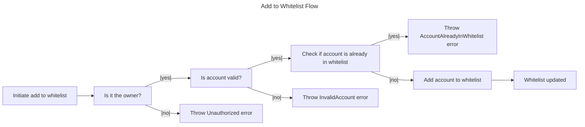
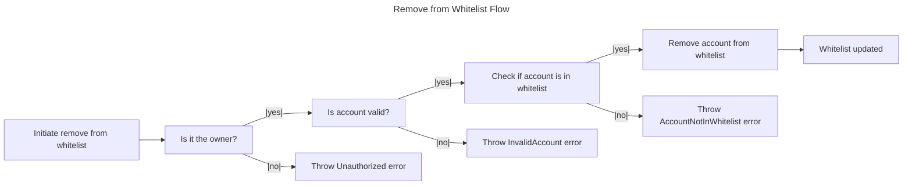

# 4. User NFT Whitelist Flow





## Contract

### Errors

The contract throws the following errors:

```solidity
// Custom error types
error InvalidFees(); // thrown when the fees are invalid (less than 0)
error InvalidRewardRate(); // thrown when the reward rate is invalid (less than 0)
error MissingNftAddress(); // thrown when the NFT contract address is not provided
error NFTAddressCannotBeZero(); // thrown when the NFT contract address is the zero address
error InvalidTokenId(); // thrown when the token ID does not exist
error NotYourNFTToken(); // thrown when the token does not belong to the user attempting an action
error InsufficientFundsSent(); // thrown when insufficient funds are sent for fees
error ClaimNotReady(); // thrown when (block.number - (stop + period)) blocks is less than 0
error Unauthorized(); // thrown when has no enough access permissions
error InvalidPeriod(); // thrown when the staking period is not valid enumerate option
error AlreadyStaked(); // thrown when attempting to start staking for a token already staked
error NFTNotStaked(); // thrown when attempting to stop staking for a token not staked by the user
error UserDoesNotExist(); // thrown when the user is not in `users` Map.
error NotInWhitelist(); // thrown when `address` not in the array.
error InsufficientRewardsPoints(); // thrown when insufficient rewards points to be consumed.
```

### Events

```solidity
// Define events
event LockNFTSuccess();
event UnlockNFTSuccess();
event RecoverNFTSuccess();
event ConsumeRewardsSuccess();
```

### Structs

```solidity
// Enum for periods
enum Period {
    ONE_DAY,
    SEVEN_DAYS,
    TWENTY_ONE_DAYS
}

// Struct for TokenData
struct TokenData {
    Period period; // Represents the period measured by height units that the NFT gets lock after unlocked where no Rewards are generated during this Period.
    uint256 start; // Starting height use on rewards calculation. Start when the owner stake and transfer ownership.
    uint256 end; // Ending height use on rewards calculation. Once unstake it, no more rewards will be counted.
}

// Struct for UserData
struct UserData {
    uint256 rewards; // Acumulated reward points, only updated when claim successful.
    mapping(uint256 => TokenData) tokens; // User token mapping data
}
```

### Variables

```solidity
// State Variables
address public nft; // Represents the ERC721 address
uint256 public rewardRate; // Represents how many rewards are produced by each height increase while staked
uint256 public fees; // Fees for startStaking(), stopStaking() and recover()
mapping(address => UserData) public users; // users staking and nft data
mapping(address => bool) public whitelist; // list of smart contracts that can interact with user points
```

### Functions

```solidity
/**
 * @dev Constructor function for the contract
 * @param _nftAddress Address of the NFT contract
 * @param _rewardRate Reward rate for staking
 * @param _feeAmount Fee amount for locking NFTs
 */
constructor(address _nftAddress, uint256 _rewardRate, uint256 _feeAmount) public {
  // - Store the owner.
  // - Check `rewardRate` =< 0
  //   - Throw `InvalidRewardRate`.
  // - Set `rewardRate`.
  // - Check `erc721` address == "".
  //   - Throw `MissingNftAddress`
  // - Check `erc721` address == 0.
  //   - Throw `NFTAddressCannotBeZero`
  // - Set `erc721` address.
  // - Check `rewardRate` < 0
  //   - Throw `InvalidFees`.
  // - Set `fees`.
}
```

```solidity
// --- Execute: addToWhitelist ---
/**
 * @dev Add to whitelist
 * @param account Account address to add
 */
function addToWhitelist(address account) public {
    // Check if `msg.sender == owner`
    //  - Throw Unauthorized
    // Add or Update `whitelist` with `account`
}
```

```solidity
// --- Execute: removeFromWhitelist ---
/**
 * @dev Remove from whitelist
 * @param account Account address to remove
 */
function removeFromWhitelist(address account) public {
    // Check if `msg.sender == owner`
    //  - Throw Unauthorized
    // Remove `account` from `whitelist`
}
```

## User Scenarios

```gherkin
Feature: Add to Whitelist
  As the owner
  I want to add an account to the whitelist
  So that the account can interact with user points

  Scenario: Add account to whitelist successfully
    Given I am the owner
    And the account is valid
    And the account is not already in the whitelist
    When I add the account to the whitelist
    Then the account is added to the whitelist
    And I receive a success message

  Scenario: Fail to add account to whitelist - unauthorized
    Given I am not the owner
    And the account is valid
    When I add the account to the whitelist
    Then I receive an Unauthorized error

  Scenario: Fail to add account to whitelist - invalid account
    Given I am the owner
    And the account is invalid
    When I add the account to the whitelist
    Then I receive an InvalidAccount error

  Scenario: Fail to add account to whitelist - account already in whitelist
    Given I am the owner
    And the account is valid
    And the account is already in the whitelist
    When I add the account to the whitelist
    Then I receive an AccountAlreadyInWhitelist error
```

```gherkin
Feature: Remove from Whitelist
  As the owner
  I want to remove an account from the whitelist
  So that the account can no longer interact with user points

  Scenario: Remove account from whitelist successfully
    Given I am the owner
    And the account is valid
    And the account is in the whitelist
    When I remove the account from the whitelist
    Then the account is removed from the whitelist
    And I receive a success message

  Scenario: Fail to remove account from whitelist - unauthorized
    Given I am not the owner
    And the account is valid
    When I remove the account from the whitelist
    Then I receive an Unauthorized error

  Scenario: Fail to remove account from whitelist - invalid account
    Given I am the owner
    And the account is invalid
    When I remove the account from the whitelist
    Then I receive an InvalidAccount error

  Scenario: Fail to remove account from whitelist - account not in whitelist
    Given I am the owner
    And the account is valid
    And the account is not in the whitelist
    When I remove the account from the whitelist
    Then I receive an AccountNotInWhitelist error
```

### Acceptance Criteria

* The `addToWhitelist` function successfully adds a valid account to the whitelist when called by the owner.
* The `addToWhitelist` function throws an Unauthorized error when called by a non-owner.
* The `addToWhitelist` function throws an InvalidAccount error when called with an invalid account.
* The `addToWhitelist` function throws an AccountAlreadyInWhitelist error when called with an account that is already in the whitelist.
* The `removeFromWhitelist` function successfully removes a valid account from the whitelist when called by the owner.
* The `removeFromWhitelist` function throws an Unauthorized error when called by a non-owner.
* The `removeFromWhitelist` function throws an InvalidAccount error when called with an invalid account.
* The `removeFromWhitelist` function throws an AccountNotInWhitelist error when called with an account that is not in the whitelist.

### Test Data Requirements

* Valid accounts
* Invalid accounts
* Accounts that are already in the whitelist
* Accounts that are not in the whitelist
* Owner and non-owner addresses

### Definition of Done (DoD)

* The `addToWhitelist` and `removeFromWhitelist` functions are implemented and tested.
* The functions throw the correct errors for edge cases.
* The functions are tested with valid and invalid inputs.
* The functions are reviewed and approved by a peer.
* The functions are deployed to the testnet and mainnet.
* The functions are verified to work correctly on the testnet and mainnet.

## Description

### Whitelisting Mechanism Explanation

### **Overview**

The whitelisting mechanism in `Staking.sol` allows the contract owner to manage a list of authorized accounts that can interact with user points. This ensures controlled access to sensitive operations.

### **Step-by-Step Breakdown**

#### **1. Adding an Account to the Whitelist**

* **Function:** `addToWhitelist(address account)`
* **Caller:** Must be the contract **owner**
* **Input:** `account` (address to be added)
* **Process:**
 1. **Authorization Check**: Verify `msg.sender` is the **owner**.   * **Failure:** Throw **Unauthorized** error.
 2. **Account Validation**: Implicitly, the contract assumes the account is valid if it's a properly formatted Ethereum address.
 3. **Duplicate Check**: Verify the `account` is not already in the **whitelist**.
  * **Failure (Implicit in Code Structure):** Though not explicitly shown, adding a duplicate should ideally throw an **AccountAlreadyInWhitelist** error (as per the defined error types). However, the provided code snippet does not explicitly handle this scenario; it simply adds or updates the whitelist without checking for duplicates.
 4. **Add to Whitelist**: Update the **whitelist** mapping with the new `account`.
* **Outcome:** The `account` is successfully added to the **whitelist**, enabling it to interact with user points.

#### **2. Removing an Account from the Whitelist**

* **Function:** `removeFromWhitelist(address account)`
* **Caller:** Must be the contract **owner**
* **Input:** `account` (address to be removed)
* **Process:**
 1. **Authorization Check**: Verify `msg.sender` is the **owner**.
  * **Failure:** Throw **Unauthorized** error.
 2. **Account Existence Check**: Verify the `account` exists in the **whitelist**.
  * **Failure:** Throw **AccountNotInWhitelist** error.
 3. **Remove from Whitelist**: Update the **whitelist** mapping to remove the specified `account`.
* **Outcome:** The `account` is successfully removed from the **whitelist**, revoking its access to interact with user points.

### **Error Handling and Security Considerations**

* **Unauthorized Access**: Thrown when a non-owner attempts to add or remove an account.
* **Account Already in Whitelist**: Ideally should be thrown when attempting to add a duplicate account (though not explicitly handled in the provided `addToWhitelist` snippet).
* **Account Not in Whitelist**: Thrown when attempting to remove a non-existent account from the whitelist.

### **Integration with NFT Staking**

* The whitelisting mechanism is designed to work in conjunction with the NFT staking functionality, ensuring that only authorized accounts can perform sensitive operations related to staked NFTs.
* The specifics of how these interactions are managed (e.g., which operations are restricted to whitelisted accounts) are not detailed in the provided snippets but are crucial for the overall security and functionality of the contract.
