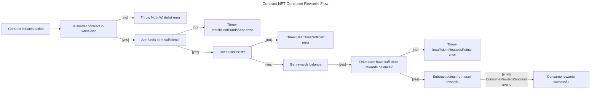

# 5. User NFT Recover Flow



## Contract

### Errors

The contract throws the following errors:

```solidity
// Custom error types
error InvalidFees(); // thrown when the fees are invalid (less than 0)
error InvalidRewardRate(); // thrown when the reward rate is invalid (less than 0)
error MissingNftAddress(); // thrown when the NFT contract address is not provided
error NFTAddressCannotBeZero(); // thrown when the NFT contract address is the zero address
error InvalidTokenId(); // thrown when the token ID does not exist
error NotYourNFTToken(); // thrown when the token does not belong to the user attempting an action
error InsufficientFundsSent(); // thrown when insufficient funds are sent for fees
error ClaimNotReady(); // thrown when (block.number - (stop + period)) blocks is less than 0
error Unauthorized(); // thrown when has no enough access permissions
error InvalidPeriod(); // thrown when the staking period is not valid enumerate option
error AlreadyStaked(); // thrown when attempting to start staking for a token already staked
error NFTNotStaked(); // thrown when attempting to stop staking for a token not staked by the user
error UserDoesNotExist(); // thrown when the user is not in `users` Map.
error NotInWhitelist(); // thrown when `address` not in the array.
error InsufficientRewardsPoints(); // thrown when insufficient rewards points to be consumed.
```

### Events

```solidity
// Define events
event LockNFTSuccess();
event UnlockNFTSuccess();
event RecoverNFTSuccess();
event ConsumeRewardsSuccess();
```

### Structs

```solidity
// Enum for periods
enum Period {
    ONE_DAY,
    SEVEN_DAYS,
    TWENTY_ONE_DAYS
}

// Struct for TokenData
struct TokenData {
    Period period; // Represents the period measured by height units that the NFT gets lock after unlocked where no Rewards are generated during this Period.
    uint256 start; // Starting height use on rewards calculation. Start when the owner stake and transfer ownership.
    uint256 end; // Ending height use on rewards calculation. Once unstake it, no more rewards will be counted.
}

// Struct for UserData
struct UserData {
    uint256 rewards; // Acumulated reward points, only updated when claim successful.
    mapping(uint256 => TokenData) tokens; // User token mapping data
}
```

### Variables

```solidity
// State Variables
address public nft; // Represents the ERC721 address
uint256 public rewardRate; // Represents how many rewards are produced by each height increase while staked
uint256 public fees; // Fees for startStaking(), stopStaking() and recover()
mapping(address => UserData) public users; // users staking and nft data
mapping(address => bool) public whitelist; // list of smart contracts that can interact with user points
```

### Functions

```solidity
/**
 * @dev Constructor function for the contract
 * @param _nftAddress Address of the NFT contract
 * @param _rewardRate Reward rate for staking
 * @param _feeAmount Fee amount for locking NFTs
 */
constructor(address _nftAddress, uint256 _rewardRate, uint256 _feeAmount) public {
  // - Store the owner.
  // - Check `rewardRate` =< 0
  //   - Throw `InvalidRewardRate`.
  // - Set `rewardRate`.
  // - Check `erc721` address == "".
  //   - Throw `MissingNftAddress`
  // - Check `erc721` address == 0.
  //   - Throw `NFTAddressCannotBeZero`
  // - Set `erc721` address.
  // - Check `rewardRate` < 0
  //   - Throw `InvalidFees`.
  // - Set `fees`.
}
```

```solidity
// --- Execute: consumeRewards ---
/**
 * @dev Consume rewards
 * @param points Number of points to consume
 */
function consumeRewards(uint256 points) public payable {
    // - Check if `msg.value >= fees`
    //   - Throw error `InsufficientFundsSent`
    // Check if `msg.sender` is on whitelist
    //   - Throw error `NotInWhitelist`
    // Check if user has sufficient rewards balance
    //   - Throw error InsufficientRewardsPoints
    // Subtract points from user rewards
    // emit event ConsumeRewardsSuccess
}
```

```solidity
// --- Query: rewardsBalance ---
/**
 * @dev Get rewards balance
 * @param user User address
 * @return Rewards balance
 */
function rewardsBalance(address user) public view returns (uint256) {
    // Check if `user` exist
    //  - Throw UserDoesNotExist
    // Return `user.rewards`
}
```

## User scenarios

```gherkin
Feature: Consume Rewards
  Scenario: User consumes rewards
    Given the user has a rewards balance
    And the user is on the whitelist
    When the user consumes their rewards
    Then the user's rewards balance is updated
    And the ConsumeRewardsSuccess event is emitted
  Scenario: User attempts to consume rewards with insufficient balance
    Given the user does not have a sufficient rewards balance
    When the user attempts to consume their rewards
    Then an InsufficientRewardsPoints error is thrown
  Scenario: User attempts to consume rewards when not on the whitelist
    Given the user is not on the whitelist
    When the user attempts to consume their rewards
    Then a NotInWhitelist error is thrown
  Scenario: User attempts to consume rewards with insufficient funds sent
    Given the user does not send sufficient funds
    When the user attempts to consume their rewards
    Then an InsufficientFundsSent error is thrown
```

### Acceptance Criteria

* The user can consume their rewards when they have a sufficient balance and are on the whitelist.
* The user is prevented from consuming rewards when they don't have a sufficient balance.
* The user is prevented from consuming rewards when they're not on the whitelist.
* The user is prevented from consuming rewards when they don't send enough funds.

### Test Data Requirements

* User with a rewards balance
* User not on the whitelist
* User with insufficient rewards balance
* User sending insufficient funds

### Definition of Done (DoD)

* The ConsumeRewardsSuccess event is emitted when the user consumes their rewards.
* An InsufficientRewardsPoints error is thrown when the user attempts to consume rewards with insufficient balance.
* A NotInWhitelist error is thrown when the user attempts to consume rewards when not on the whitelist.
* An InsufficientFundsSent error is thrown when the user attempts to consume rewards with insufficient funds sent.

## Description

### NFT Stake and Consume Rewards Flow Explanation

### **Step-by-Step Breakdown**

#### **1. User Initialization**

* **Precondition**: User has an NFT and is interacting with the Staking contract.
* **Action**: User's data is stored in the `users` mapping (`address => UserData`) if not already present.
* **State Change**: `UserData` struct is initialized for the user, including `rewards` (initially 0) and a `tokens` mapping for NFT data.

#### **2. Locking NFT (Staking)**

* **Precondition**: User owns the NFT and has sufficient funds for fees.
* **Action**: User calls `startStaking()` with the NFT's token ID and chosen staking period.
* **State Change**:
  * Fees are deducted from the user.
  * NFT is locked (transferred to the contract or marked as staked).
  * `TokenData` (period, start block, end block) is created and linked to the user's `UserData`.

#### **3. Earning Rewards**

* **Passive Action**: As blocks are mined, the user earns rewards based on the `rewardRate` and staking period.
* **State Change**: The user's `rewards` balance is updated periodically (not in real-time, but upon next interaction requiring balance check).

#### **4. Unlocking NFT (Unstaking)**

* **Precondition**: User's NFT is staked and the staking period has ended (or user chooses to recover early).
* **Action**: User calls `stopStaking()` or `recover()` with the NFT's token ID.
* **State Change**:
  * NFT is unlocked (transferred back to the user or marked as unstaked).
  * `TokenData` is updated or removed from the user's `UserData`.

#### **5. Consuming Rewards**

* **Precondition**: User has a sufficient `rewards` balance and is on the `whitelist`.
* **Action**: User calls `consumeRewards()` specifying the points to consume.
* **State Change**:
  * User's `rewards` balance is decreased by the consumed amount.
  * `ConsumeRewardsSuccess` event is emitted.
  * Fees are deducted for the transaction.

### **Error Handling Scenarios**

* **Insufficient Funds**: Thrown during staking or consuming rewards if user doesn't send enough ether.
* **Not in Whitelist**: Thrown when attempting to consume rewards without being on the whitelist.
* **Insufficient Rewards Points**: Thrown when trying to consume more rewards than available.
* **User Does Not Exist**: Thrown for non-initialized users attempting to interact with their non-existent data.
* **NFT Not Staked**: Thrown when trying to unstake an NFT that's not currently staked by the user.
